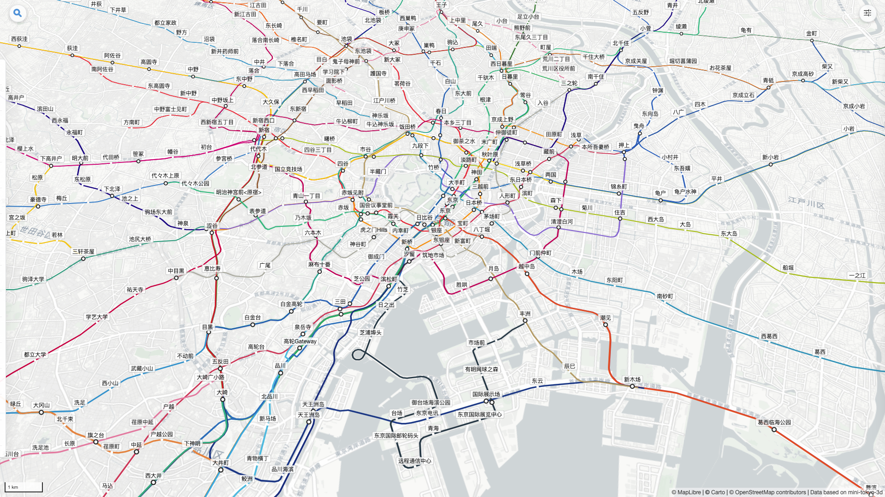
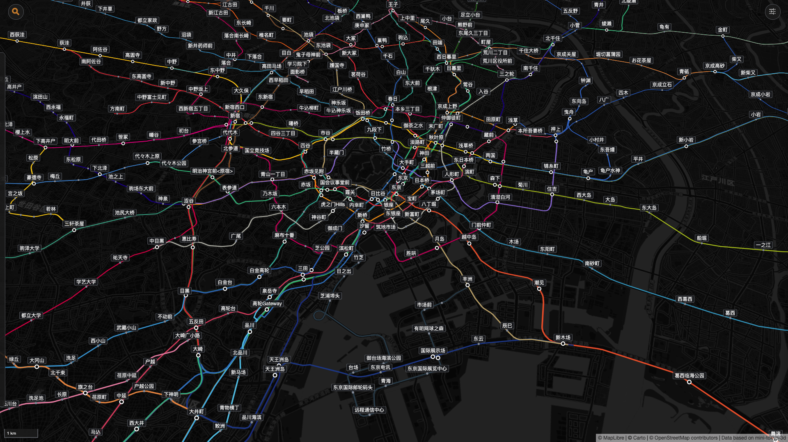
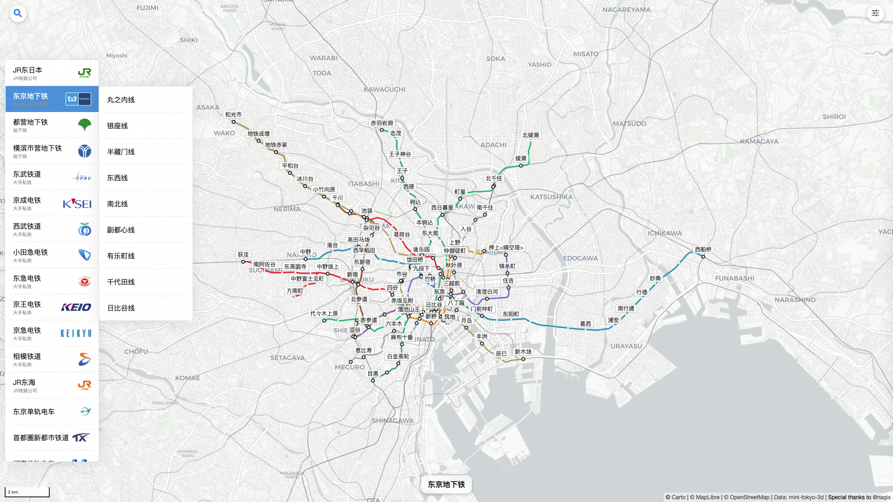
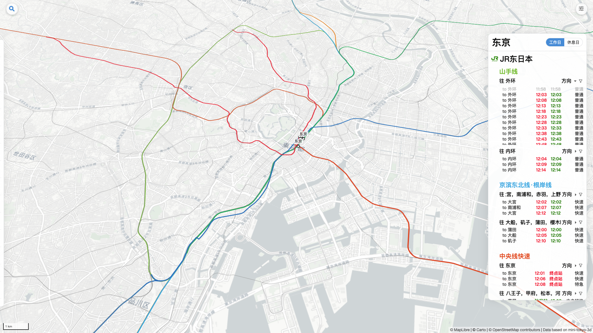
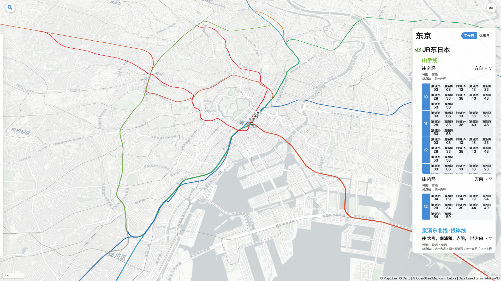
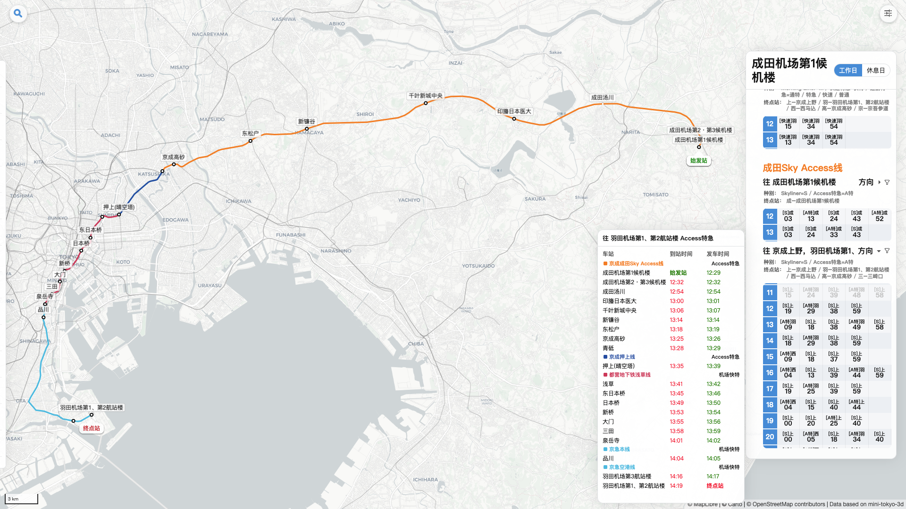
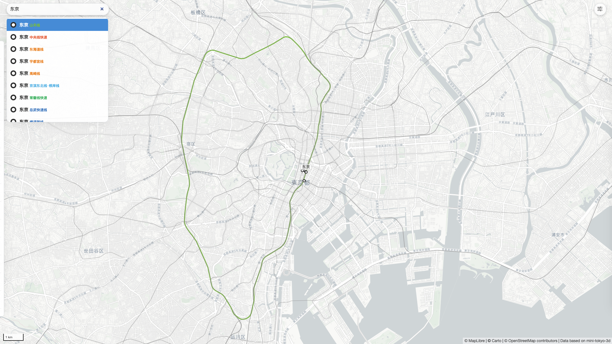

# TokyoRailMap 东京铁路地图

东京都市圈铁路线网与班次信息可视化。

## 在线使用

可直接通过 GitHub Pages 访问：

- [TokyoRailMap](https://blysh-ley.github.io/TokyoRailMap/)

## 功能介绍

本项目用于查看东京都市圈铁路网络与班次信息，支持线路、站点与班次的查询。

### 1) 线路高亮

左侧菜单可按运营公司或单条线路高亮展示。

### 2) 站点面板与双视图

点击站点后，可查看该站的换乘线路与班次信息；支持“列表”与“一览”两种展示方式。
可在右上角的设置面板中修改。

### 3) 班次详情与直通显示

点击班次可查看该车次经由线路、停靠站点及时刻表，并支持直通车次展示。

### 4) 截图导出

点击右上角的相机按钮，可将当前高亮的线路或站点导出为高质量 PNG 图片。

功能特点：
- 自动检测当前选中的公司、线路或站点范围（包括视线外的部分）
- 智能调整视图到 16:9 或 9:16 宽高比
- 根据线路范围自动选择 4K 或 1080p 分辨率，避免过大或过小
- 仅保留地图内容，自动隐藏所有 UI 元素
- 导出完成后自动恢复原始视图

### 5) 搜索

支持线路与站点的简单搜索。暂不支持路径规划。

## 数据说明

数据主要来源于 [mini-tokyo-3d](https://github.com/nagix/mini-tokyo-3d) 的静态数据。

- 当前不包含实时数据；
- 班次信息仅供参考，请勿作为实际出行的唯一依据。

## License

本项目使用 [MIT License](https://opensource.org/license/MIT)。

## 致谢

感谢 [mini-tokyo-3d](https://github.com/nagix/mini-tokyo-3d) 提供的数据基础。

## 声明

本项目代码由作者与 AI 工具共同完成。